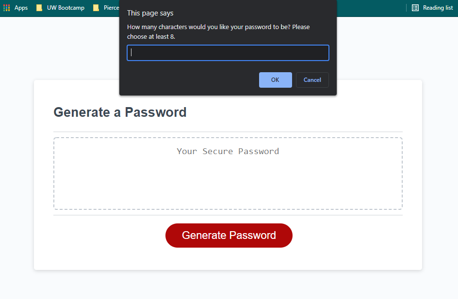

# Password Generator

Password Generator is a javascript enabled web based application that allows the user to conveniently generate a random, secure password based off user input criteria. The criteria entails enabling (password length, Lowercase, uppercase, numerical values, and special characters).
